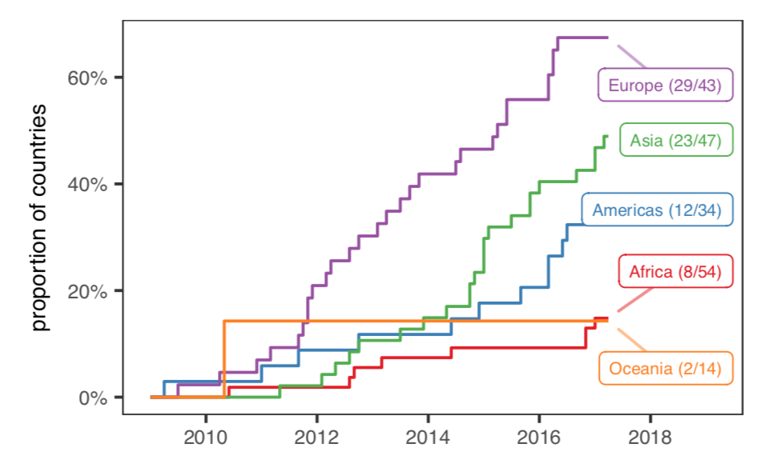
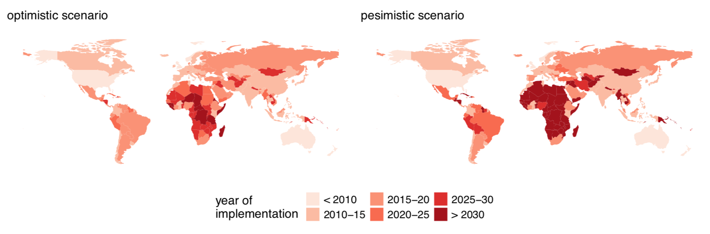

# The present and future status of open government data

Few organizations have the potential that government has to use their data to transform society. 

Here, I use the date in which a country opened an open government data portal (such as data.govt.nz) as a proxy for a country support for open data. Open data portals are a good indication of the progress of open data because–by making datasets discoverable and managing metadata–they have the potential to accelerate the creation of value
(Attard et al. 2015).

**See full report in pdf**

I found that the adoption of open government data is not homogeneous across regions (Figure below). Europe seems to be at the vanguard of in terms of support for open government data portals. In particular there was a period of rapid growth between 2012 and 2014 when most West European countries launched their portals. In Asia and the Americas the largest growth occurred after 2014 and are currently on
track to catch up with European countries. Growth in Africa and Oceania has been rather moderate and, with a few exceptions, governments are yet to embrace open data. Using the historical records also allow us to identify the pioneers of open data. The USA, UK, Norway, Australia, and New Zealand, all launched their open government data portals in the earliest dates, setting up the example to other countries to follow.

 

  

 

Using a survival model to this data I forecasted the expected date in which open government data portals could be implemented in the countries that have not yet done so (Figure below). Under the current trajectory, the most likely outcome is that ~70% of the nations would embrace open government data portals by 2030. This includes all European countries and most countries in Asia, Oceania, and the Americas, but excludes a large proportion of central and west african countries, and poor and conflictive countries in Asia.

 

  

 

# Methodology

To obtain the web address of the open data portals were open I curated an automated search that returned the 10 first results of a Google Search in an english locale for the string “Open Data + [country]” for each of the 193 United Nations member states. I then obtained an approximate opening date for the portal by automatically retrieving the date in which the site was first registered by the Wayback Machine, which keeps historical snapshots of billions of URLs over time. This data would be easily improved by performing searches in local languages. 

I then constructed a model to determine how the gross domestic product per capita and the number of internet users (per 100 people) are related to the launch date of the data portals. Specifically, I used a *parametric survival regression model* under the assumption that the launch date follows a Weibull distribution (Therneau and Grambsch 2000). 

## Reproduce results

I know I should do a makefile, but for now, in order to recreate it:

1. Run `google-search.py` (good luck not getting blocked by Google, I had to open two different nodes in Digital Ocean to get around that. The script `install_python.sh` should speed that up)
2. Cure the results into `data/dataportals.csv` indicating the result number that correspond to the portal
3. Run `scarp-wayback-machine.R`
4. Run `process_scrapping_results.R`
5. Knit `open_data_history.Rmd`

Fernando
